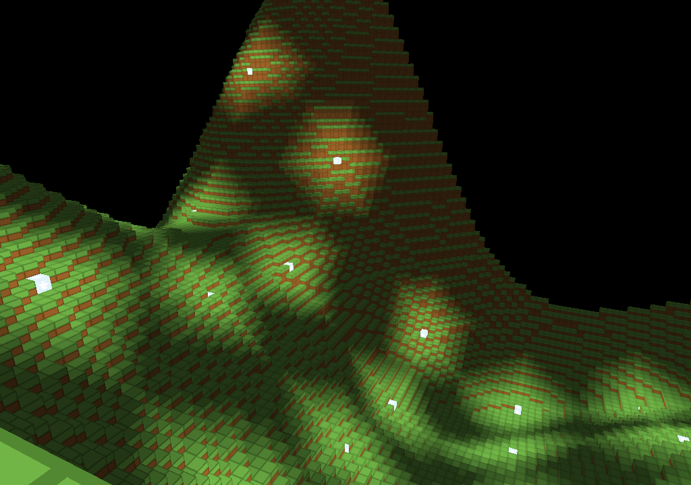

# Openverse

Openverse is a sandbox open-world voxel game developed with modding in mind.

### Before building

You need to install some dependencies:

- https://github.com/upperlevel/event-api
- https://github.com/upperlevel/hermes
- https://github.com/upperlevel/ulge

All dependencies can be installed through the command:

```
gradlew install
```

### How to run

How to run openverse-client:
```
gradlew :openverse-client:run
```

How to run openverse-server:
```
gradlew :openverse-server:run
```

### Gallery


